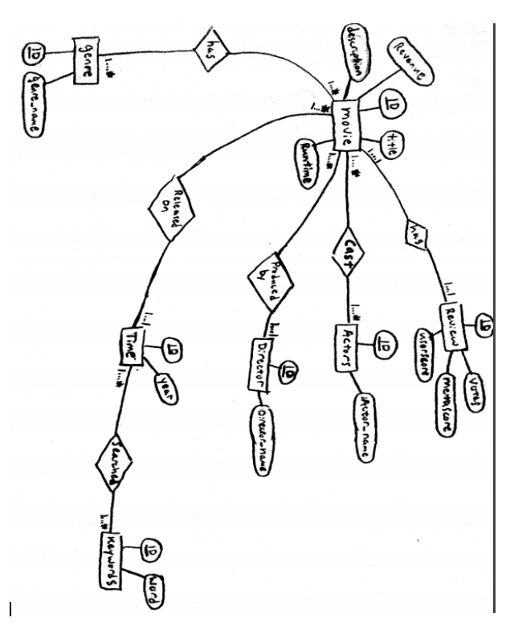

# CS586 Grad Project
## Sunanth Sakthivel

### ER Diagram

### Create Table Statements
The create table statements are all found in [load.sql](https://github.com/sunanth123/DBproject/blob/master/load.sql)

### How Database was populated
1. Raw data from comma seperated list was used to populate all the tables: [Data](https://github.com/sunanth123/DBproject/blob/master/IMDB-Movie-Data.csv)
2. The data from .csv was then loaded using copy command into a temporary storage table.
3. The different genres were loaded from the storage table into the genre table by using a regexp_split_to_table on commas.
4. The different actors were also loaded from the storage table the same way (by looking at the distinct actors seperated by commas)
5. The director information was loaded directly from the storage table (distinct directors are loaded).
6. The time table had its years loaded manually by entering years from 2006-2016.
7. The keywords table was inserted manually with all the keywords (top movie keywords from google trends by year).
8. The review information had its information loaded directly from the storage table.
9. The remaining information from the storage table were then loaded into the movie table. 
10. The search table was manually entered to match the popular keywords for the respective year.
11. Lastly, the join tables casting and hasgenre were loaded with the appropriate foreign keys such that they reference the correct attributes. (note the foreign key connections in these join tables are done useing subqueries, see [load.sql](https://github.com/sunanth123/DBproject/blob/master/load.sql)).

### 20 Questions
1. **How many movies are there by year of release?**   QUERY: select count(m.title), t.year from movie m join time t on m.time_id = t.id group by t.year;
[Result](https://github.com/sunanth123/DBproject/blob/master/QueryResults/1.txt)

2. **What movies had a revenue of greater than 1 million, were released after 2010 and has a user score above 8.0?**   QUERY: select m.title from movie m, time t where m.revenue >= 1 and m.time_id = t.id and t.year > 2010 intersect select m.title from movie m, review r where m.review_id = r.id and r.userscore > 8;
[Result](https://github.com/sunanth123/DBproject/blob/master/QueryResults/2.txt)   *Original question: What movies had a revenue of greater than 1 million and were released after 2010? The reason for change was the query was too simple and I wanted to incorporate an intersect with this particular question.*

3. **What movies had a vote count greater than 100,000 and have a critic and user review above 80%?**   QUERY: select distinct m.title from movie m, review r where m.review_id = r.id and r.votes > 100000 and r.metascore > 80 and r.userscore > 8;
[Result](https://github.com/sunanth123/DBproject/blob/master/QueryResults/3.txt)

4. **What movies had a user review greater than the critic review?**   QUERY: select distinct m.title from movie m where exists (select r.id from review r where m.review_id = r.id and r.userscore*10 > r.metascore);
[Result](https://github.com/sunanth123/DBproject/blob/master/QueryResults/4.txt)

5. **What are the total number of movies found in each genre?**   QUERY: select count(m.title), g.genre_name from movie m, genre g, hasgenre hg where m.id = hg.movie_id and g.id= hg.genre_id group by g.genre_name;
[Result](https://github.com/sunanth123/DBproject/blob/master/QueryResults/5.txt)

6. **What is the highest grossing revenue for each genre?**   QUERY: select max(m.revenue), g.genre_name from movie m, genre g, hasgenre hg where m.id = hg.movie_id and g.id= hg.genre_id group by g.genre_name;
[Result](https://github.com/sunanth123/DBproject/blob/master/QueryResults/6.txt)

7. **Which actor or actors acted in the most movies?**   QUERY: Select a.actor_name, count(c.actor_id) from actor a, casting c where c.actor_id = a.id group by a.actor_name Having count(c.actor_id) = (select max(condition.go) from (Select count(c.actor_id) as go from casting c group by c.actor_id) as condition);
[Result](https://github.com/sunanth123/DBproject/blob/master/QueryResults/7.txt)   *Orginal question: What is the total number of actors for each movie? The reason for the change was because the data that was found listed the top 4 actors for every movie so the query would've resulted in 4 for all movies.* 

8. **What are the list of actors who acted in at least one movie with runtime below 60 min?**   QUERY: select a.actor_name from movie m, actor a, casting c where m.id = c.movie_id and c.actor_id = a.id and m.runtime < 60;
[Result](https://github.com/sunanth123/DBproject/blob/master/QueryResults/8.txt)

9. **What are the list of directors who directed a movie that grossed above a million dollars?**   QUERY: select distinct d.director_name from movie m, director d where m.director_id = d.id and m.revenue > 1;
[Result](https://github.com/sunanth123/DBproject/blob/master/QueryResults/9.txt)

10. **What is each director’s longest and shortest movies?**   QUERY: select d.director_name, max(m.runtime), min(m.runtime) from movie m, director d where m.director_id = d.id group by d.director_name;
[Result](https://github.com/sunanth123/DBproject/blob/master/QueryResults/10.txt)

11. **What movies have a runtime above 70 min and have a gross revenue of below 100,000 dollars or have a runtime below 70 min and have a gross revenue of above 700 million dollars?**   QUERY: select m.title, m.revenue, m.runtime from movie m where m.runtime > 70 and m.revenue < 0.1 union select m.title, m.revenue, m.runtime from movie m where m.runtime > 70 and m.revenue > 700;
[Result](https://github.com/sunanth123/DBproject/blob/master/QueryResults/11.txt)   *Original question: What movies have a runtime above 60 min and have a gross revenue of below 300,000 dollars? I changed this question because everysingle movie in the database is above 60 min and furthermore I wanted to check in interesting dynamic between movies that did well in the box office but are short compared with movies that were long but did poorly.*

12. **What is the average revenue of movies by year?**   QUERY: select t.year, avg(m.revenue) as millaverage from time t, movie m where m.time_id = t.id group by t.year;
[Result](https://github.com/sunanth123/DBproject/blob/master/QueryResults/12.txt)

13. **What is the average critic and average user reviews by year?**   QUERY: select t.year, avg(r.metascore) as average_critic, avg(r.userscore) as average_user from time t, review r, movie m where m.time_id = t.id and m.review_id = r.id group by t.year;
[Result](https://github.com/sunanth123/DBproject/blob/master/QueryResults/13.txt)

14. **What is the list of movies and descriptions of movies with actor “Tom Hanks” or “Leonardo DiCaprio”?**   QUERY: select m.title, m.description from movie m, casting c, actor a where m.id = c.movie_id and c.actor_id = a.id and (a.actor_name = 'Leonardo DiCaprio' or a.actor_name = 'Tom Hanks');
[Result](https://github.com/sunanth123/DBproject/blob/master/QueryResults/14.txt) 

15. **Who are all the actors who also directed at least one movie?**   QUERY: select a.actor_name from actor a, director d where a.actor_name = d.director_name;
[Result](https://github.com/sunanth123/DBproject/blob/master/QueryResults/15.txt)

16. **What is the highest grossing movies by year?**   QUERY: select t.year, m.title, m.revenue from movie m, time t where m.time_id = t.id and m.revenue in (select max(m.revenue) from time t, movie m where m.time_id = t.id group by t.year) order by t.year ASC;
[Result](https://github.com/sunanth123/DBproject/blob/master/QueryResults/16.txt)

17. **What is the number of genres for each movie?**   QUERY: select m.title, count(g.genre_name) from movie m, genre g, hasgenre hg where m.id = hg.movie_id and hg.genre_id = g.id group by m.title;
[Result](https://github.com/sunanth123/DBproject/blob/master/QueryResults/17.txt)

18. **What are the list of top movie keywords on google by year?**   QUERY: select t.year, k.word from time t, keywords k, search s where t.id = s.time_id and s.keyword_id = k.id;
[Result](https://github.com/sunanth123/DBproject/blob/master/QueryResults/18.txt)

19. **What top movie keywords on google appear more than one year?**   QUERY: select k.word from keywords k, search s where s.keyword_id = k.id group by k.word having count(*) > 1;
[Result](https://github.com/sunanth123/DBproject/blob/master/QueryResults/19.txt)

20. **What are the years that contain a keyword that has appeared for more than one year?**   QUERY: select distinct t.year from time t, search s, keywords k where t.id = s.time_id and s.keyword_id = k.id and k.word in (select k.word from keywords k, search s where s.keyword_id = k.id group by k.word having count(*) > 1);
[Result](https://github.com/sunanth123/DBproject/blob/master/QueryResults/20.txt)   *Original question: What are the highest grossing movies on all the years that contain the most frequently used movie keyword? The reason for the change was because the question was phrased ackwardly and didn't make much sense in a query standpoint.* 

## Contents of Tables
The contents of all the tables can be found in the text files in this folder: [Contents](https://github.com/sunanth123/DBproject/tree/master/ContentsofTables)

 

